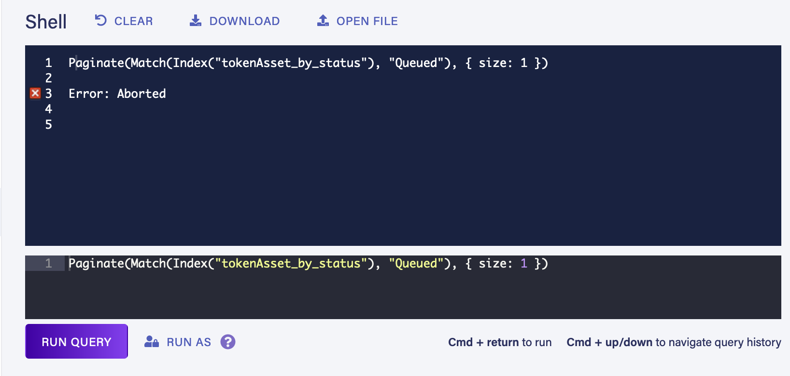

## Notes
- **Indexes are not as optimized** as one would expect.
	- Low cardinality in large collections leads to generic errors `An internal server error occurred. Please contact Fauna support.`
	- Prescribed solution is to restructure data so that instead of index separate collections are used
	- Fitting data model to faunas internal limitations is really concerning
- **Full text search** is going to be a problem
	- According to fauna devs it's another can of worms
	- It would be required if we want to allow search on nft.storage as opposed to full CID / URL based match
- **Lack of expertise**
	- Trigram would need to go through learning curve
	- Irakli would need to assist with hand off / education
	- Web search often lead to fauna docs with misleading solutions (e.g. use ngrams in index or use unions in queries)
- **Need to ship**, can't be switching db's now that schema migration had being in progress for this long
	- If we consider all the time needed to do following vs just using [[postgres as a service]] would  math still favor going with fauna ?
		- [fix niftysave](https://github.com/ipfs-shipyard/nft.storage/issues/316)
		- onboard trigram
		- stats work that would require cron jobs with aggregates
- Are there going to run into **more problems ?**
	- Niftysave, web3.storage and nft.storage all switched to batching due to fauna's concurrency errors
		- Possibly due to fauna doing locks on index as opposed to documents
		- Andrew is hitting this with web3.storage
- **What are we getting from fauna** that we may loose with postgres ?
## Action List
- DONE @gozala will attempt to reduce batch size to see if it can serve us as bandaid and unblock niftysave
  done:: 1629224928229
  now:: 1629224927245
  later:: 1629224926524
  id:: 611becac-75c9-4724-b25f-4425a45b4767
	- Attempt to get even a single document from index seems to timeout now
	- 
- NOW If reduces batch size is still not working @gozala will implement [[fauna recommendation for task handling]]
  later:: 1629222113020
  id:: 611becac-3896-47d4-b03f-499d6da3608d
  now:: 1629225008872
- LATER @gozala will talk with trigram about fauna to get a sense if trying postgres might help us with stats and other tasks we're trying to handoff
  later:: 1629222119171
  id:: 611bf189-1d4e-4ed8-997a-1370c6531c6c
- @hugomrdias will continue migration efforts to fauna